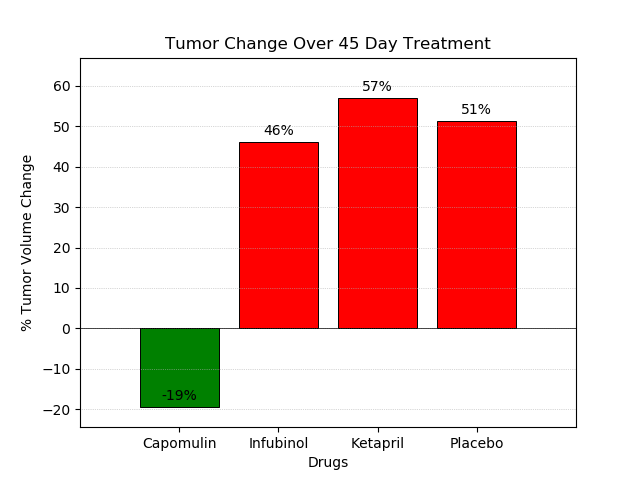
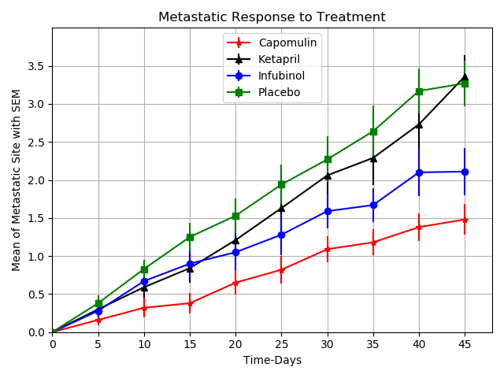
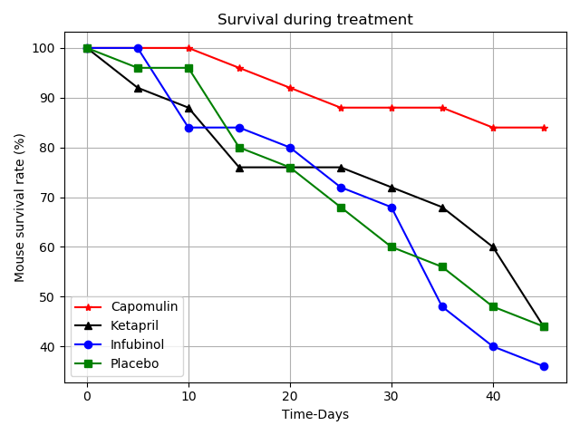

# Tasks

•	Scatter plot that shows how the tumor volume changes over time for each treatment.

•	Scatter plot that shows how the number of metastatic (cancer spreading) sites changes over time for each treatment.

•	Scatter plot that shows the number of mice still alive through the course of treatment (Survival Rate)

•	Bar graph that compares the total % tumor volume change for each drug across the full 45 days.

•	Three observations about the results of the study. Use the visualizations you generated from the study data as the basis for your observations.

# Libraries used

•	Used  Pandas Library and the Jupyter Notebook.

•	Used the Matplotlib library.

•	A written description of three observable trends based on the data.

•	Proper labeling of plots, including aspects like: Plot Titles, Axes Labels, Legend Labels, X and Y Axis Limits, etc.

•	Scatter plots includes error bars. This will allow the company to account for variability between mice. 

# OBSERVATIONS

The three observations about the results of the study showing how four treatments (Capomulin, Infubinol, Ketapril, and Placebo) compare.

1.	Out of the four drugs used only Capomulin provided reduction (19%) in tumor, rest of the drugs failed to reduce tumor as it grew approximately 50% more during the 45 days trial period.

2.	Metastatic spread trends suggest that Capomulin and Infubinol applied mice have significant reduction in the spread of tumor after 10 days till end of the experiment, but the Ketapril and Placebo continued to spread at higher rates all through the study period.

3.	Among the four drugs Capomulin showed maximum mouse survival rate at 84% after the 45 days of experiment, whereas Ketapril and Placebo gave 44% survival of mice during the same period. Among the four drugs the least survival was for Infubinol at 36%. Capomulin has consistently given higher rate of survival at every stage of the experiment. However, the rate of survival among Ketapril, Placebo and Infubinol shows relative variations at different stages of the experiment.

